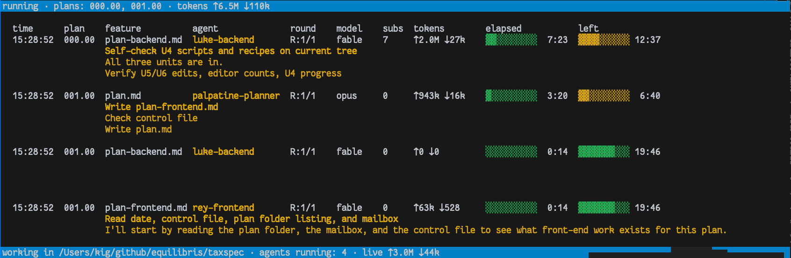

# agentilda-ai-setup (v2.0.0)

[](https://dl.circleci.com/status-badge/redirect/gh/kigster/agentilda/tree/main)

#### What is this?

This repo is a collection of installers (BASH and Ruby) which ensure a consistent vendor-neutral agentic setup on your computer, coupled with an agentic software team that diligently creates your feature specs in collaboration with you, and then works on them until they become reviewed, CI-passing PRs that you get to merge.

Here is a screenshot of agents working on two plans at the same time, but on two different phases of the process:



> [!NOTE]
> 1. [`agentilda`](<>) is the Ruby Gem, which is a CLI tool that creates and manages the `.plans` folder, and comes with eight or so specialized agents that take a spec.md file and work through it until it's a set of PRs open, reviewed, and passing on your CI. It does not automatically merge anything.
> 1. [`agentilda-ai-setup`](https://kigster/agentilda-ai-setup) is the GitHub repo that's a mixture of BASH and Ruby installers. It's comes with the [`configuration.yml`](https://github.com/kigster/agentilda-ai-setup/blob/main/configuration.example.yml) file, which lists the installation commands for the coding agents you'd like to install locally, any other executables you might want (for instance, it installs `bt` — braintrust's CLI utility), and then you can list any number of Github Repos and use them to install skills, plugins, commands from them, specifying exactly which you want to install and which you want to exclude. Moreover you can specify a sub-directory of a github repo to install from.
> 1. The final piece of the puzzle is the locking gem **[`agent-lock`](https://github.com/kigster/agent-lock)**. This flexible gem comes with the executable `alock` and a skill teaching agents how to use it. Using `alock` agents can work in parallel in the same worktree but on different files, sub-folders, and so on. The gem uses locally running Redis as the default backend, and if that's not available, it uses the file system. The choice of the backend happens once and is saved in the git-ignored file in your local working repo.
>
> Together, the three repos, after installation provide you with the consistent way to replicate your `~/.agents` and `~/.claude` folders on multiple computers, and to enable a consistent agentic software team workflow across any number of many projects.

______________________________________________________________________

## Customizing Configuration

Before you proceed to install anything, it is strongly recommended that you copy the [example configuration file](https://github.com/kigster/agentilda-ai-setup/blob/main/configuration.example.yml) to `configuration.yml`:

```bash
cp configuration.example.yml configuration.yml
vim configuration.yml
```

Configuration file defines what skills and plugins and going to get installed in you two global directories:

- `~/.agents` (receivies actual files — eg copies of skills, plugins, etc, does not depend on this repo checkout post install)
- `~/.claude/` (receive symlinks into `~/.agents` to reduce duplication, although some claude-specific plugins are supported as well.)

### Features

- Installs plugins and skills from remote repositories ensuring latest versions
- Can install partial skills from a given repo based on regular expression matching
- Can install plugins by executing commands
- Can install plugins targeting specific AI agent
- Comes with an executable `agentilda` which a CLI tool written in Ruby that drives a multi-agent workflow, manages `.plans` folders for project (where spec and plans live), syncs with Linear and much more.

## Quick Install

```bash
# pre-requisite
gem install agentilda agent-lock

# now install these skills and plugins
bin/install
```

### What install does

For your benefit, here is the output of `bin/install --help`:

```bash
# install — build, copy this checkout into ~/.agents, then link it into ~/.claude.

# build, copy what is missing, never overwrite
bin/install                

# replace what is already in ~/.agents
bin/install --force        
  
# say what it would do, touch nothing
bin/install --dry-run   
  
# skip the build; copy what is already there
bin/install --no-sources

# stop after the copy, skip the linking step
bin/install --no-setup     
```

Three steps, and the checkout is none of them.

1. scripts/install-sources assembles skills/ and plugins/ in the checkout from configuration.yml. They are generated: nothing under either is committed, so on a fresh clone neither exists until this has run.

1. this copies the result into ~/.agents with every symlink resolved, so ~/.agents holds real files and the checkout can then be moved, renamed or deleted without anything dangling.

1. bin/setup links ~/.agents into ~/.claude, unchanged. It needs no table of its own: the copy below is what turns src/commands into commands and workflow/agents into agents, so what setup walks is the flat tree it has always walked.

### Notes

Step 1 is not optional, and not silent. skills/ missing after it has run means it did not get far enough to build one — most often because `configuration.yml` was only just seeded and is waiting to be read. Copying anyway would install a tree with no skills in it and report success, so it stops instead. `--no-sources` is for the case where you built already.

The trade this makes, deliberately: editing src/skills/foo no longer shows up in `~/.claude` until this is run again. An installed tree that keeps.

## Digging Deeper

There are three granular steps that you can run independently, or you can skip to the next section and insetall all at once.

1. `scripts/install-sources` assembles `skills/` and `plugins/` in the checkout from `configuration.yml`. Both are **generated** — nothing under either is committed, so a fresh clone has neither until this has run.
1. `bin/install` copies the result into `~/.agents` with every symlink resolved, so it holds real files and the checkout can afterwards be moved, renamed or deleted with nothing left dangling.
1. `bin/setup` links `~/.agents` into `~/.claude`, so that there is no duplication.

## Aggregated Installer

`bin/install` runs all three. The first is not optional and not silent: if `skills/` is missing after the build, it stops rather than installing a tree with no skills in it and reporting success. That usually means `configuration.yml` was only just seeded and is waiting to be read. `--no-sources` skips the build for a checkout you have already built.

`bin/install --dry-run` previews the lot. `--force` is required to replace anything already installed, and to replace a `~/.agents` that is still a symlink to a checkout from the old arrangement.

The trade, deliberately: an edit to `src/skills/foo` reaches `~/.claude` only when you run it again.

### Configuring what gets installed

`configuration.yml` is the file the installer reads. It is git-ignored and per machine, because which skills and which coding agents a machine should have is a property of that machine. A first run copies `configuration.example.yml` across and then stops, so you get to read it before it installs anything.

It has two top-level keys. `agents:` names the coding agents themselves and the vendor's own install line for each:

```bash
# which are configured, and which are on PATH
scripts/install-sources agents            

# install the ones that are missing
scripts/install-sources agents install    

# run each entry's update: line, for the ones already here
scripts/install-sources agents update     
```

`executables:` is the same block for everything else that should be on PATH, and takes the same three verbs. An entry's `update:` is the vendor's own line for bringing it up to date; it runs only when asked for by name, never as part of a sync.

`sources:` names where skills and plugins come from. A source clones a repository (`type: skills`, `type: plugin` for one bundle, `type: plugins` for a directory of them) or runs a command (`type: command`, for something like Braintrust's `bt`, which ships its skill through its own CLI rather than a repository). Any source can narrow itself:

```yaml
- name: ruby-marketplace
  type: skills
  repo: https://github.com/hoblin/claude-ruby-marketplace
  path: plugins
  # exclude_skills too, if you want both
  include_skills: /\A(rspec|activerecord)\z/
  # or exclude_agents, never boths 
  agents: [claude]                             
```

Filters are matched against the name a thing installs as, not its path inside the source. Set both keys of a pair and they apply in the order the file writes them, last match winning, so `include_plugins: /.*/` followed by `exclude_plugins: /\Aruby-lsp\z/` takes every bundle but that one. `agents:` is matched against the `agents:` block above, and a source no configured agent would read is skipped and reported rather than installing skills nothing can load.

**Tightening a filter takes skills back as well as adding them.** The next run unlinks whatever it installed last time and no longer installs, so `skills/` converges on what the file says rather than accumulating.

### Keeping it up to date

```bash
# rebuild, re-copy, re-link; --force replaces what is there
bin/install --force            

# wipe .sources and re-clone every source from scratch
scripts/install-sources -f     

# repoint symlinks that aim somewhere else
bin/setup --force              

# preview all of it, touch nothing
bin/install --dry-run          
```

`bin/install` never replaces anything already in `~/.agents` without `--force`, and refuses outright to replace a `~/.agents` that is still a symlink to a checkout from the old arrangement.

______________________________________________________________________

## What is in here

| Path                        | What it is                                                                                                                         |
| :-------------------------- | :--------------------------------------------------------------------------------------------------------------------------------- |
| `config/AGENTS.md`          | The instructions every agent reads. Symlinked to `~/AGENTS.md` and `~/.claude/CLAUDE.md`                                           |
| `context/`                  | What every agent gets regardless, including about.md which you should update to be about you.                                      |
| `src/skills/`               | Skills authored in this repo (committed); folded into `skills/` by `install-sources`                                               |
| `src/commands/`             | Slash commands that wrap `agentilda` with the right guardrails baked in                                                            |
| `skills/`                   | Claude skills, **generated**, one directory per skill, symlinked into `~/.claude/skills/`                                          |
| `plugins/`                  | External plugin bundles (e.g. `pstack`), also generated, not committed                                                             |
| `configuration.example.yml` | Committed template for the git-ignored `configuration.yml`, the list `scripts/install-sources` pulls `skills/` and `plugins/` from |
| `bin/`                      | **Bash** executables. `setup` is a pure symlink reconciler                                                                         |
| `scripts/`                  | **Ruby**: `install-sources`, which runs before there is a bundle to run it in                                                      |
| `docs/`                     | Documentation for people rather than context for agents: runbooks, the coverage badge, usage notes                                 |
|                             |                                                                                                                                    |

Executables sit in three places, by what each needs in order to run. `bin/` holds shell, `scripts/` holds the one Ruby executable that must work before a bundle exists.

`skills/` and `plugins/` are **not committed**. Both are entirely regenerable from `configuration.yml` plus `src/skills/` (which is committed, since it's this repo's own work). A skill that went stale with no way to tell where it came from was the exact problem `install-sources` exists to solve:

```bash
# clone what's missing, update the rest
scripts/install-sources          

# wipe and re-clone every source fresh
scripts/install-sources -f       

# what's configured, and what's installed from where
scripts/install-sources list     
```

Add a repo to `configuration.yml` instead of installing something by hand. `type: skills` treats every `SKILL.md`-rooted directory found (at any depth) as its own skill; `type: plugin` installs the whole thing into `plugins/<name>` and, if it carries its own `skills/`, fans those out individually too; `type: plugins` does that for every directory under `path`, which is how one entry takes several bundles out of one marketplace repository.

A source that carries more than you want narrows itself with regular expressions, matched against the name each skill or bundle installs as:

```yaml
  - name: pstack
    type: plugin
    repo: git@github.com:cursor/plugins.git
    path: pstack
    # exclude_skills too, if you want both
    include_skills: /\A(architect|unslop|why)\z/   
```

Tightening a filter takes skills back as well as adding them: the next run unlinks whatever it installed last time and no longer installs, so `skills/` converges on what `configuration.yml` says. `bin/setup` then sweeps the matching dangling links out of `~/.claude/skills`.

### Vendor neutrality

`config/AGENTS.md`, `context/` and `scripts/` are portable — any agent that can read a file and run a command uses them. `skills/` is Anthropic's format and is only installed for Claude. `bin/setup` never replaces a real file or directory, so running it against an existing `~/.claude` is safe; it reports conflicts and skips them.

______________________________________________________________________

## Agentic Workflow

> [!NOTE]
> For full information on the workflow states and transitions, please run `tilda docs` and read the file it generates, and prints the path to it on your screen.

This repository originallhy contained a ruby gem that was the orchestrator of the Agentic Team Workflow. This gem has since been moved out of this repository into it's own, and (hopefully) by the time you read this, it will also be on RubyGems, so you can install it with `gem install agentilda`.

The gem is a Ruby CLI command `tilda` that keeps a project's specifications, plans and pull requests documents in the `.plans`, and drives a team of specialist agents over them. The agents implement the following workflow:

```
# Hppy path
⚪️ New ──▶ 
    🔎 Researched ──▶ 
        ⭐️ Planned ──▶ o
            🟡 Building ──▶ 
                🎨 Building UI ──▶ 
                    🟢 Ready for Review ──▶ 
                    👀 In Review ──▶ 
                        ✅ Approved
```

There are five agents, each tuned for a specific task.

- research,
- then a written specification,
- then a plan,
- then a frontend end, backend,
- submit PR,
- and perform an adversarial review.

Install the gem with `gem install agentilda` and then run `tilda -h` for more options. It's also recommended to add command completion to your shell. Eg, for zsh:

```bash
# ~/.zshrc
grep -q agentilda "${HOME}"/.zshrc || echo 'eval "$(agentilda completion zsh)"' >> "${HOME}/.zshrc"
```

______________________________________________________________________

© 2026 Konstantin Gredeskoul, MIT License
