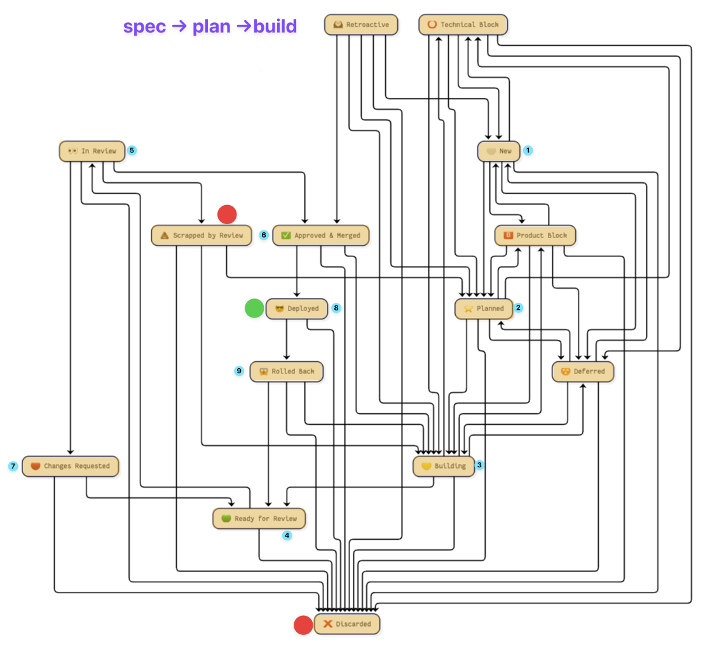
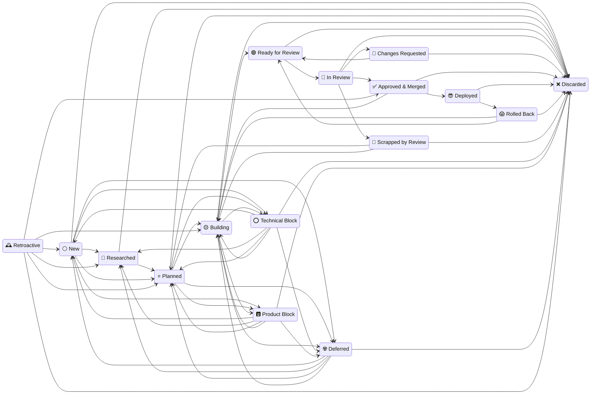

# Spec → Plan → Build

> [!IMPORTANT]
> **This file is auto generated.**
>
> To regenerate it, run `spec-plan-build docs` (which by the default writes to `context/feature-building/spec-plan-build.md`). To override the destination, use the -o | --output <file> option.
>
> After changing the state machine. Editing it by hand puts it back into the condition it was written to end: three copies of the same table, quietly disagreeing.

Every project keeps its plans in a `.plans/` directory at its root. Each medium-to-large feature gets one folder, and the folder's **name is its state**: the number identifies it forever, the emoji says what phase it is in, and the slug says what it is.

There are three phases, and each one has a file that proves it happened:

| Phase     | State             | The file that proves it |
| :-------- | :---------------- | :---------------------- |
| **spec**  | ⚪️ New            | `spec.md`               |
| **plan**  | ⭐️ Planned        | `plan.md`               |
| **build** | 🟡 → 🟢 → 👀 → ✅ | `pull-requests.md`      |

Those files are not paperwork. They are what the tool checks: a folder may not claim a phase whose file is missing, and `spec-plan-build resync dirs` renames any folder whose emoji its contents do not support.

## The number

A plan's number is its identity. It is set once, when the folder is created, and never changes: branch names, pull request titles and every `pull-requests.md` join on it, and renumbering breaks all of them silently.

The shape is always `NNN.MM`:

```
.plans/000.00-⚪️-initial-spec
.plans/001.00-✅-dev-foundation
.plans/001.01-✅-schedule-k1-backfill   <- shipped between 001 and 002,
.plans/002.00-⭐️-tenancy-households        specified afterwards
```

- **`NNN` counts from `000`.** The first plan of a project is `000.00`; after that it is the highest major plus one, zero-padded to three digits.
- **`MM` is `00` for an ordinary plan** — one specified before it was built.
- **`MM` from `01` to `99` marks a retroactive plan**: work that shipped with no specification, documented after the fact. `spec-plan-build create --after 001` takes the next free slot in the gap after 001.

`001.01` is a **sibling of 001 that arrived later, not a part of 001**. The dot reads as containment in almost every other numbering scheme, and here it does not — which is worth saying wherever the scheme is described, because the containment reading is the one a new reader brings.

Two digits, always. One would sort into the middle of the two-digit range — `001.09` < `001.1` < `001.10` — so a single mixed-width folder silently reorders the index. Two digits also retire the question of running out: 99 slots per gap, against a gap that closes the moment the next plan is created.

> [!NOTE]
> Padding every plan to `NNN.MM` is a deliberate choice, and it costs something. A bare `018` next to `018.01` would have told you at a glance which plan was specified in advance and which was written afterwards. With uniform padding that distinction is no longer readable from the number alone — it is carried by `MM > 0`, which you have to know to look for. What padding buys is alignment and one shape to parse everywhere.

**A retroactive `spec.md` must open with a dated line saying so**, naming the pull requests it describes. It documents what exists; it does not pretend to have decided anything in advance. Anchor by *when the work merged*, not by what it is about — compare merge dates against folder creation dates (`git log --diff-filter=A`). Anchoring by topic invites an argument nobody can settle, and the number is a slot, not a claim about subject matter.

## The states

| Symbol | Meaning                | Key                | Files required                           | Description                                                               |
| :----: | :--------------------- | :----------------- | :--------------------------------------- | :------------------------------------------------------------------------ |
|   ⚪️   | **New**                | `new`              | `spec.md`                                | a specification exists; it has not been planned yet                       |
|   🔎   | **Researched**         | `researched`       | `spec.md`                                | the topic has been researched; `spec.md` carries a `## Research` chapter  |
|   ⭐️   | **Planned**            | `planned`          | `spec.md`, `plan.md`                     | specified and planned; nobody has started building                        |
|   🟡   | **Building**           | `building`         | `spec.md`, `plan.md`, `pull-requests.md` | work is under way; pull requests are raised as each unit lands            |
|   🟢   | **Ready for Review**   | `ready_for_review` | `spec.md`, `plan.md`, `pull-requests.md` | every pull request is green on CI and waiting for a reviewer              |
|   👀   | **In Review**          | `in_review`        | `spec.md`, `plan.md`, `pull-requests.md` | a reviewer has picked it up and has not ruled yet                         |
|   🔴   | **Changes Requested**  | `rejected`         | `spec.md`, `plan.md`, `pull-requests.md` | the review asked for fixes; resubmit once they are made                   |
|   ✅   | **Approved & Merged**  | `approved`         | `pull-requests.md`                       | reviewed, approved, and every pull request merged                         |
|   😎   | **Deployed**           | `deployed`         | `deployed.md`                            | live in production; `deployed.md` names the release, date and SHA         |
|   😱   | **Rolled Back**        | `rolled_back`      | `rollback.md`                            | it shipped and was pulled; `rollback.md` names what broke                 |
|   💩   | **Scrapped by Review** | `shit`             | `rewrite.md`                             | the review scrapped the work; the plan survives, the pull requests do not |
|   ⭕️   | **Technical Block**    | `blocked`          | `blocked.md`                             | cannot proceed; an engineer or the CTO must decide something first        |
|   🅱️   | **Product Block**      | `product_blocked`  | `blocked.md`                             | cannot proceed; a product manager must decide something first             |
|   ☢️   | **Deferred**           | `deferred`         | `delayed.md`                             | could proceed and chose not to yet; `delayed.md` must name the trigger    |
|   🕰️   | **Retroactive**        | `retroactive`      | —                                        | the feature is live, but has neither a specification nor a plan           |
|   ❌   | **Discarded**          | `discarded`        | `discarded.md`                           | dropped for good; `discarded.md` says why. A terminal state               |

"Files required" is a **minimum**, not an exact match: a ⚪️ folder that has grown a `plan.md` still satisfies ⚪️, and is ⭐️ anyway. That is why `resync dirs` moves a folder to the furthest state its contents justify rather than only fixing outright lies.

Some states share their requirements on purpose, and are told apart only by the folder name. ⭕️ Technical Block and 🅱️ Product Block both mean "a human must decide before this can move"; *which* human is recorded nowhere but the emoji. 🟡 🟢 👀 🔴 all mean "the work exists and pull requests are open"; whether anyone has started reviewing is written down nowhere either.

So nothing re-derives one of them from a folder's contents — otherwise every ⭕️ would silently become 🅱️ the first time anything resynced. A folder falling back into that group from outside lands on its weakest member, 🟡 Building, because that is all its contents can prove.

🟣 Merged is deliberately **not** a folder state. It describes a pull request, and a folder that claimed it would be claiming a pull request's condition as its own.

## Transitions

| From                  | May become        | `promote` goes to    |
| :-------------------- | :---------------- | :------------------- |
| ⚪️ New                | 🔎 ⭐️ ⭕️ 🅱️ ☢️ ❌ | 🔎 Researched        |
| 🔎 Researched         | ⭐️ ❌             | ⭐️ Planned           |
| ⭐️ Planned            | 🟡 ⭕️ 🅱️ ☢️ ❌    | 🟡 Building          |
| 🟡 Building           | 🟢 ⭕️ 🅱️ ☢️ ❌    | 🟢 Ready for Review  |
| 🟢 Ready for Review   | 👀 ❌             | 👀 In Review         |
| 👀 In Review          | ✅ 🔴 💩 ❌       | ✅ Approved & Merged |
| 🔴 Changes Requested  | 🟢 ❌             | 🟢 Ready for Review  |
| ✅ Approved & Merged  | 🟡 😎 ❌          | 😎 Deployed          |
| 😎 Deployed           | 😱 ❌             | —                    |
| 😱 Rolled Back        | 🟡 🟢 ❌          | 🟢 Ready for Review  |
| 💩 Scrapped by Review | ⭐️ 🟡 ❌          | ⭐️ Planned           |
| ⭕️ Technical Block    | ⚪️ 🔎 ⭐️ 🟡 ☢️ ❌ | —                    |
| 🅱️ Product Block      | ⚪️ 🔎 ⭐️ 🟡 ☢️ ❌ | —                    |
| ☢️ Deferred           | ⚪️ 🔎 ⭐️ 🟡 ❌    | —                    |
| 🕰️ Retroactive        | ⚪️ 🔎 ⭐️ 🟡 ✅ ❌ | ⭐️ Planned           |
| ❌ Discarded          | _terminal_        | —                    |

A bare promote walks the **spine** — spec → plan → build. Everything off it (blocking, deferring, rejecting) has to be named explicitly. That is the whole reason there is a machine here rather than a rename: a transition is refused when the destination's requirements are not already met, and that refusal is information — it means the phase has not actually happened yet.



<details>
<summary>Mermaid source for the diagram above</summary>

<!--
REDRAWING THE PNG: only when this block changes.

The image above is drawn by hand from this source and is the version
worth reading. This block is generated from the state machine, so any
movement in it — a state added, a transition rerouted, an emoji
swapped — is the signal that docs/img/plan-spec-build.png
is stale and has to be redrawn. If this block did not move, neither did
the machine: reuse the existing PNG.
-->



</details>

## Files allowed in a plan folder

| File               | Required by                                                                                |
| :----------------- | :----------------------------------------------------------------------------------------- |
| `spec.md`          | the specification; written first                                                           |
| `plan.md`          | the execution plan; written from the spec                                                  |
| `pull-requests.md` | 🟡 Building, 🟢 Ready for Review, 👀 In Review, 🔴 Changes Requested, ✅ Approved & Merged |
| `deployed.md`      | 😎 Deployed                                                                                |
| `rollback.md`      | 😱 Rolled Back                                                                             |
| `rewrite.md`       | 💩 Scrapped by Review                                                                      |
| `blocked.md`       | ⭕️ Technical Block, 🅱️ Product Block                                                       |
| `delayed.md`       | ☢️ Deferred                                                                                |
| `discarded.md`     | ❌ Discarded                                                                               |

Nothing else belongs there. A folder holding notes, diagrams or scratch files is a folder nobody can audit at a glance.

## Pull requests carry the number

A pull request that implements a plan says so in its title:

```
[003.00] Make the core deterministic and require as_of
```

`pull-requests.md` is generated from these titles, so the prefix is the join key between a pull request and a plan, not decoration. Name branches `<user>/NNN.MM-slug` and the number carries itself from branch creation through to a merged, squashed pull request with nobody having to remember it.

`spec-plan-build resync prs` fills in missing prefixes. It reads the branch name first and falls back to the diff only when that touches exactly one plan folder. **It refuses rather than guessing.** A wrong number does not announce itself: it files the work under a plan that did not do it, and leaves the plan that did looking untouched.

### `[dev]` when there is no plan

Not every pull request implements a feature. Dependency bumps, CI configuration, hotfixes and developer tooling implement no plan, and forcing a number onto them produces a number chosen to satisfy the rule. Those are titled:

```
[dev] Bump json from 2.21.1 to 2.21.2
```

`dev` means **"this deliberately belongs to no specification"**, and it exists so that "no plan" is *asserted* rather than merely absent. A title with no prefix is ambiguous between "no plan applies" and "nobody looked".

`resync prs` will propose it, but marks every such title as **assumed** and never applies one without you seeing it. Emitting it silently on a failed lookup would launder "I could not tell" into "there is definitely none", which is the same lie as guessing a number, told in the other direction.

### What does not deserve a retroactive plan

Most unmatched pull requests. The test is whether **somebody would need to read it** — a capability with behaviour, an interface, or invariants that are not obvious from the code. "Fix a typo", "remove dead code" and "bump a dependency" are `[dev]` and always were. Backfilling those produces an index that is longer without being more informative, which makes the real plans harder to find.

## If a real issue tracker arrives, this scheme retires

This numbering is homegrown because there is nothing else to join on. If the work moves to Linear or Jira, **the issue key replaces it**: `[EQL-142] <title>` in pull request titles, `EQL-142-<status>-<slug>` for the folder, and the issue becomes the thing `pull-requests.md` is generated against.

Recording that matters more than it looks. A numbering scheme with no stated exit becomes permanent by default: it accretes tooling, the tooling accretes rules, and by the time a real tracker shows up, migrating is a project rather than a decision. The exit is cheap only while it is written down and unbuilt.

Two things to hold to when that day comes:

- **Existing numbers are not rewritten.** A plan's number is its identity and merged pull request titles are immutable history. `000` stays `000` forever and new plans start taking issue keys. A mixed index is ugly for a while and honest permanently, which beats a renumbering that breaks every link that ever pointed at a plan.
- **Do not teach the tooling to accept issue keys before the tracker exists.** A validator that accepts `[EQL-142]` with nothing to check it against is a guard that passes anything shaped like an answer, which is worse than one that fails loudly on first use.

______________________________________________________________________

Generated by `spec-plan-build docs` — version 1.0.0.
