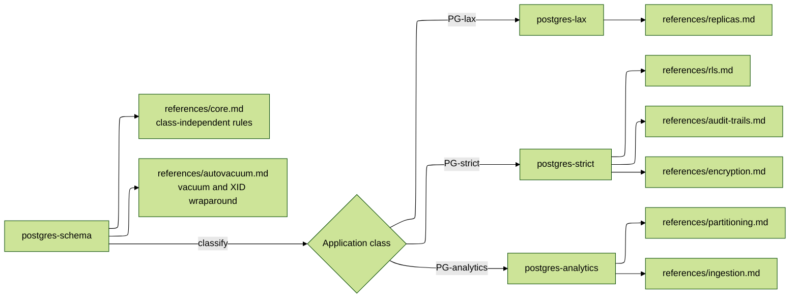

# PostgreSQL Skills

Four agent skills covering PostgreSQL schema design, migrations and operations, arranged so that an agent reads the universal rules once and then loads only the material for the class of database it is actually working on.

## The shape

| Skill                | Covers                                                                                                                                                                                                                           |
| :------------------- | :------------------------------------------------------------------------------------------------------------------------------------------------------------------------------------------------------------------------------- |
| `postgres-schema`    | Entry point. Classifies the application, then routes. Holds every rule that is true regardless of class: naming, primary keys, migration safety, timeouts, index mechanics, money, pooling, observability, pgvector, autovacuum. |
| `postgres-lax`       | Non-critical OLTP. Physical deletes, `ON DELETE CASCADE`, `READ COMMITTED`, and scaling by putting many read replicas behind one primary.                                                                                        |
| `postgres-strict`    | Money, PII, health records. Logical deletes, immutable ledgers, row-level security, audit triggers, column encryption, locking discipline.                                                                                       |
| `postgres-analytics` | Warehouses. Declarative partitioning, retention by `DROP PARTITION`, `COPY`-based ingestion, materialized views, BRIN.                                                                                                           |

## The classification rule

**Default to `PG-lax`, then escalate per table.** Most applications are lax. Any individual table holding money, PII, health data or anything with a legal consequence follows the `PG-strict` rules for that table while the rest of the schema stays lax. An application is `PG-strict` as a whole when the strict tables are the point of the product rather than a corner of it.

The class belongs in the project's `AGENTS.md` or `CLAUDE.md`, written down once, so that no agent has to guess and no two agents guess differently.

## Reading order

Every class skill assumes `postgres-schema/references/core.md` has already been read, and none of them repeat it. An agent that lands directly on `postgres-strict` is told, at the top of the file, to go back and read the core first.

## Installing

All four live in `src/skills/`, one directory each, and `scripts/install-sources` links every one of them into `skills/` because that is what it does with every child of `src/skills/`. Nothing has to be added to `configuration.yml`: that file is for sources fetched from elsewhere, and these were written here.

The four install as a set, and that matters. The router is useless without the skills it routes to, and each class skill is incomplete without the router's `references/core.md`. Narrowing the set by hand leaves an agent following half a convention.
