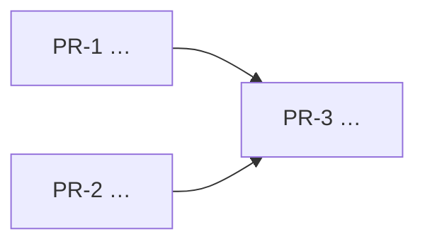

# [NNN.MM] [Feature Name] — Plan

The spec says *what* and *why*. The plan says *in what order, by whom, and how
we will know it worked*. Write it so that several agents can execute it at once
without colliding — if it can only be done by one worker in one sequence, say so
explicitly, because that is a constraint worth seeing.

**Spec:** `spec.md` in this folder
**Depends on:** plans that must land first, by number
**Unblocks:** what becomes possible once this ships
**Size:** N pull requests

______________________________________________________________________

## Goals

Carried from the spec, unchanged. If the plan needs a goal the spec does not
have, the spec is wrong — fix it there first.

## Non-Goals

Also carried from the spec. This is the section that prevents the scope
argument in review.

______________________________________________________________________

## Work units

One per pull request. Each names its own seam, and the seams are what make
concurrency possible: two units that touch the same files are not concurrent,
whatever the diagram says.

### PR-1 — [Title, which becomes the pull request title after the `[NNN.MM]`]

**Owns:** the files and directories this unit may write.
**Must not touch:** the files another unit owns. Name them.
**Depends on:** PR-n, or *nothing* — say "nothing" out loud, because that is
what makes it startable now.

**What it does:**

- [ ] …
- [ ] …

**Done when:**

- [ ] tests exist and pass
- [ ] [the observable behaviour a reviewer can check]

### PR-2 — […]

______________________________________________________________________

## Execution order

State which units can run **in parallel** and which are genuinely sequential.
"Sequential because it is tidier" is not a dependency; "sequential because PR-3
imports the module PR-1 creates" is.

## Risks

| Risk | Likelihood | What we do about it |
| :--- | :--------- | :------------------ |
|      |            |                     |

The useful entries are the ones with a mitigation that changes the plan, not the
ones that restate the difficulty.

## Acceptance

How we know the whole feature — not each unit — is done. If this is only "all
the PRs merged", the plan has no acceptance criteria; say what the system can do
now that it could not before.
