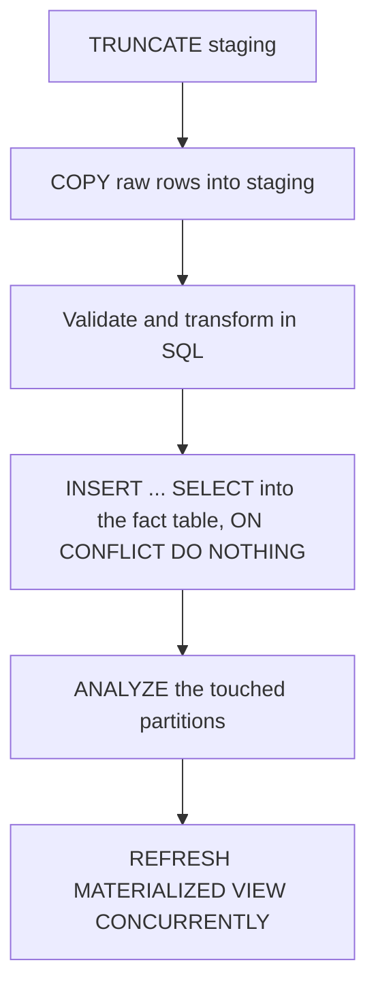

# Batch Ingestion and Materialized Views

## Load with COPY, not with INSERT

`COPY` is the single largest performance difference available in this area, and it is not close. A row-at-a-time `INSERT` pays statement parsing, planning and a round trip per row; `COPY` streams. An order of magnitude is the usual gap, and two is common.

```sql
COPY staging_events (occurred_at, account_id, kind, payload)
  FROM '/data/events-2026-09-14.csv'
  WITH (FORMAT csv, HEADER true);
```

From an application, use the driver's streaming interface rather than shelling out - in Ruby, `pg`'s `copy_data` with `put_copy_data`; every mature driver has an equivalent. If you are stuck with `INSERT`, use multi-row `VALUES` batched at a few thousand rows per statement inside one transaction, which recovers most of the gap.

**Load into a staging table first, always.** A staging table is unlogged, unindexed, owned by the loader and truncated at the start of each run:

```sql
CREATE UNLOGGED TABLE staging_events (LIKE events INCLUDING DEFAULTS);
```

`UNLOGGED` skips WAL entirely, which roughly halves the write cost. The price is that the table does not survive a crash and is not replicated - both irrelevant for data you are about to re-derive, and both disqualifying for anything else.

## The load sequence



The parts people skip, and should not:

- **Validate in SQL, in the staging table.** It is faster than in the application and the rejects stay queryable. Move bad rows to a `rejected_events` table rather than aborting the batch, then alert on the count.
- **`ANALYZE` after a large load.** Autovacuum will get to it eventually; the first query after the load runs against stale statistics in the meantime, and on a warehouse that first query may be the twenty-minute one. `ANALYZE events_2026_09;` on the touched partition costs seconds.
- **Drop and recreate indexes for a very large initial load**, then rebuild with a large `maintenance_work_mem` and parallel workers. For an incremental daily load this is not worth it; for the initial hundred-million-row backfill it is the difference between hours and days.

## Idempotent upserts

Batch pipelines get re-run. Design for it rather than deduplicating afterwards:

```sql
-- Append-only fact: a natural key and a unique index make re-runs free
INSERT INTO events (occurred_at, account_id, kind, payload, source_id)
SELECT occurred_at, account_id, kind, payload, source_id
  FROM staging_events
  ON CONFLICT (source_id, occurred_at) DO NOTHING;

-- Dimension: last write wins on the columns that change
INSERT INTO dim_accounts (account_id, name, plan, updated_at)
SELECT account_id, name, plan, now() FROM staging_accounts
  ON CONFLICT (account_id) DO UPDATE
    SET name = EXCLUDED.name,
        plan = EXCLUDED.plan,
        updated_at = EXCLUDED.updated_at
  WHERE dim_accounts.* IS DISTINCT FROM EXCLUDED.*;
```

The `WHERE ... IS DISTINCT FROM` clause on the `DO UPDATE` is worth the keystrokes: without it, a re-run rewrites every dimension row, producing a full table's worth of dead tuples for no change at all.

## Materialized views

A materialized view is a cached query result on disk. In a warehouse it is how a dashboard that would take ninety seconds takes eighty milliseconds.

```sql
CREATE MATERIALIZED VIEW daily_account_revenue AS
  SELECT account_id,
         date_trunc('day', occurred_at) AS day,
         sum(amount_cents)              AS revenue_cents,
         count(*)                       AS event_count
    FROM events
   GROUP BY 1, 2
  WITH NO DATA;

-- Required for CONCURRENTLY. Without it, every refresh locks readers out.
CREATE UNIQUE INDEX ON daily_account_revenue (account_id, day);

REFRESH MATERIALIZED VIEW daily_account_revenue;
```

> [!CAUTION]
> **`REFRESH MATERIALIZED VIEW` without `CONCURRENTLY` takes an `ACCESS EXCLUSIVE` lock for the whole refresh**, so every dashboard querying it blocks until the refresh finishes. Always create a unique index on the view and always refresh `CONCURRENTLY`. The concurrent refresh is slower in wall-clock terms and does not block anybody, which is the trade you want.

Refresh strategy, in order of preference:

1. **Refresh after the load that changes the data**, as the last step of the pipeline. Predictable, and the view is never more stale than one batch.
1. **Refresh on a schedule** if the sources are continuous. Pick the interval from what the dashboard actually needs, and put the last refresh time on the dashboard so nobody debugs stale numbers as a data bug.
1. **Roll your own incremental table** when a full refresh stops fitting in the window. A real table plus an upsert of only the affected date range is more code than a materialized view and scales when the view does not. PostgreSQL has no built-in incremental refresh; anything claiming otherwise is an extension, and should be evaluated as one.

**Chain them carefully.** A materialized view built on another materialized view must be refreshed in dependency order, and nothing enforces that for you. Two levels is manageable; more wants a real orchestration tool.

## BRIN, and why it belongs here

A BRIN index stores the min and max value per block range rather than an entry per row. On an append-only table whose physical order matches the time column - exactly what a fact table is - it gives you usable time-range filtering at roughly a thousandth of the size of the equivalent B-tree.

```sql
CREATE INDEX ON events USING brin (occurred_at) WITH (pages_per_range = 32);
```

It only works while physical order tracks the indexed column. A table that gets updated in place, or loaded out of order, degrades to uselessness quietly - and `pages_per_range` is the knob: smaller means a bigger, more precise index. If the load is out of order, either sort the batch before loading or use a B-tree and pay for it.
