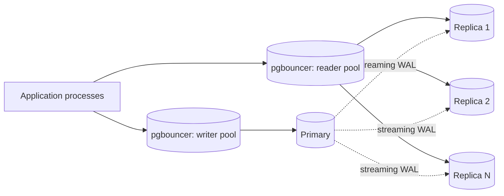

# One Primary, Many Replicas

The `PG-lax` scaling story is almost always the same one: the primary is fine on writes and drowning on reads, so you put replicas behind it and send the reads there. This file is how to do that without inventing a new class of bug.

## Topology



**Streaming replication is the default and the right answer** for read scaling: physical, whole-cluster, low overhead, and the replica is a byte-for-byte copy you can promote. Logical replication is a different tool - use it to move a subset of tables between clusters, to replicate across major versions, or to feed an analytics instance, not to scale reads.

Four decisions that are easy to get wrong:

1. **Synchronous or asynchronous.** Asynchronous by default. `synchronous_commit = on` with a synchronous standby means every commit waits for a network round trip to that standby, and if the standby dies, writes stop until you change the setting. `PG-lax` accepts a few milliseconds of lag in exchange for a primary that does not care whether replicas are healthy.
1. **Replication slots, and the disk they can eat.** A slot guarantees the primary keeps WAL until the replica has consumed it. That is exactly what you want when a replica restarts, and exactly how a decommissioned replica fills the primary's disk and takes the cluster down. **Always set `max_slot_wal_keep_size`** so the primary drops a hopeless slot rather than dying with it, and **drop the slot when you drop the replica**. An orphaned slot also pins the transaction ID horizon; see `postgres-schema/references/autovacuum.md` for how that ends.
1. **`hot_standby_feedback`.** On, the replica tells the primary which rows its long queries still need, and the primary delays vacuuming them - your replica queries stop being cancelled, and your primary bloats. Off, vacuum runs freely and long replica queries get cancelled with `ERROR: canceling statement due to conflict with recovery`. For `PG-lax` read replicas serving short web queries, leave it **off** and cap `statement_timeout` on the reader role. Turn it on only for a replica dedicated to long reports, and then accept the bloat on the primary.
1. **How many.** Replicas are cheap for read throughput and not free for the primary: each one consumes a WAL sender process and network bandwidth. Three is a lot for most applications. If you need more, the problem is usually a missing index or a missing cache, not a missing replica.

## Routing: the part applications get wrong

Rails ships `ActiveRecord::Middleware::DatabaseSelector`, which sends reads to the primary for a fixed window (2 seconds by default) after any write in that session. It is a decent blunt default and it is not enough: the window is a guess, and it is per-session, so it does nothing for a background job reading a record another process just wrote.

**The pattern that actually works is an explicit block that reads from the replica and falls back to the primary when the record isn't there yet:**

```ruby
module EventuallyConsistent
  # Run the block against a read replica. If the replica has not caught up -
  # the record is missing, or the result is empty - run it again against the
  # primary, where it is guaranteed to be visible.
  #
  #   eventually_consistent do
  #     User.find_by!(first_name: "Alan")   # must RAISE or return a value
  #   end
  #
  # @param retry_if_blank [Boolean] also retry on an empty result, not just
  #   on RecordNotFound. Relations and `find_by` return nil/[] rather than
  #   raising, and those are the same "not replicated yet" condition.
  def eventually_consistent(retry_if_blank: true)
    result = ActiveRecord::Base.connected_to(role: :reading) { yield }
    return result unless retry_if_blank && blank_result?(result)

    ActiveRecord::Base.connected_to(role: :writing) { yield }
  rescue ActiveRecord::RecordNotFound
    ActiveRecord::Base.connected_to(role: :writing) { yield }
  end

  private

  def blank_result?(result)
    result.respond_to?(:empty?) ? result.empty? : result.nil?
  end
end
```

> [!CAUTION]
> **ActiveRecord relations are lazy, and that will defeat this block silently.**
>
> `eventually_consistent { User.where(first_name: "Alan") }` returns an *unloaded* relation; the query then executes later, outside the block, against whichever connection happens to be current. Nothing runs on the replica and nothing is retried. Force evaluation **inside** the block - `.first`, `.to_a`, `.load`, `.find_by!`, `.count` - or the whole thing is decoration.

Two more rules that keep this honest:

1. **Reads that must be authoritative do not go to a replica at all.** A balance you are about to debit, a uniqueness check, anything feeding a write decision - read it from the primary, under `FOR UPDATE` if it matters. Retry-on-miss is for display paths, not for correctness paths.
1. **Measure the lag, do not assume it.** `pg_last_xact_replay_timestamp()` on the replica and `pg_stat_replication` on the primary tell you what it actually is. Alert on it. A replica hours behind because a replication slot filled the disk is a different incident from the one you think you are debugging.

## Connection pooling per replica

Pool to each replica separately, and size each pool on its own hardware. The formula from `core.md` applies per target:

```
pool_size (per target) = (core_count x 2) + effective_spindle_count
```

A common and wrong arrangement is one pooler pointing at a load balancer in front of the replicas: you lose per-replica visibility, a lagging replica silently gets a third of your traffic, and you cannot drain one for maintenance. Point the pooler at named hosts.

```ini
; pgbouncer.ini
[databases]
app_primary = host=pg-primary  dbname=app pool_size=20
app_read_1  = host=pg-replica1 dbname=app pool_size=20
app_read_2  = host=pg-replica2 dbname=app pool_size=20

[pgbouncer]
pool_mode = transaction
max_prepared_statements = 200   ; needed to keep Rails prepared statements in transaction mode
```

Transaction mode is what makes pooling worth doing, and it breaks session-scoped state. Use transaction-scoped advisory locks, move `LISTEN`/`NOTIFY` to a dedicated unpooled connection, and set role defaults with `ALTER ROLE ... SET` rather than per-session `SET`.

## Replica-specific role settings

The reader role wants different limits from the writer role, and setting them per role means nobody has to remember:

```sql
ALTER ROLE app_reader SET statement_timeout = '15s';
ALTER ROLE app_reader SET default_transaction_read_only = on;
ALTER ROLE app_reader SET idle_in_transaction_session_timeout = '30s';
```

`default_transaction_read_only` is worth setting even though the replica already refuses writes: the error arrives from the pool the application thinks it is talking to, with a message that names the cause, rather than as a confusing recovery-mode error.

## What to watch

| Question                                              | Where to look                                    |
| :---------------------------------------------------- | :----------------------------------------------- |
| How far behind is each replica, in bytes and seconds? | `pg_stat_replication` on the primary             |
| How stale is the data I am reading right now?         | `pg_last_xact_replay_timestamp()` on the replica |
| Is a slot retaining WAL for a replica that is gone?   | `pg_replication_slots` where `active = false`    |
| Are replica queries being cancelled?                  | `pg_stat_database_conflicts` on the replica      |

Alert on the first and the third. A slot that is inactive and growing is the incident that takes the primary down, and it gives you hours of warning if anybody is looking.
