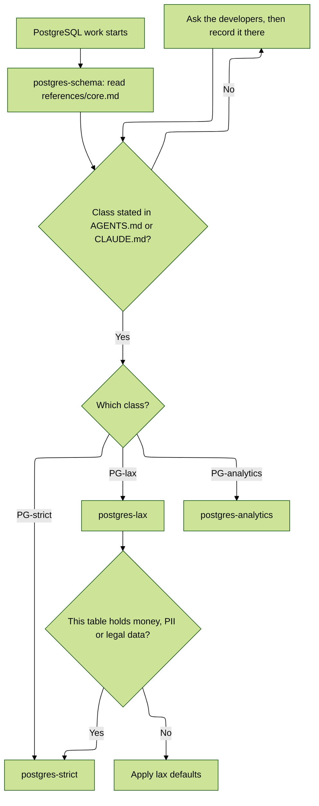

# PostgreSQL Schema Design

This skill is the entry point for all PostgreSQL work. It does three things, in order:

1. **Classifies the application**, because every later decision leans on the class.
1. **Points you at the class-specific skill** that carries the recipes for that class.
1. **Names the handful of rules whose violation is silent and expensive**, so they are in front of you even if you read nothing else.

> [!IMPORTANT]
> **The class-independent conventions are not written here.** They live in [`references/core.md`](references/core.md) - decades of accumulated practice, and the single source of truth for everything that is true regardless of application class. **Read that file before writing schema or migration code.**
>
> [`references/autovacuum.md`](references/autovacuum.md) covers autovacuum and transaction ID wraparound: read it before touching autovacuum settings, and before assuming a wraparound warning can wait.

## Step zero, and it is not optional

**Classify the application before applying any rule.** There are three classes:

| Class          | Shape                                                                                                                                                         | Then load            |
| :------------- | :------------------------------------------------------------------------------------------------------------------------------------------------------------ | :------------------- |
| `PG-lax`       | OLTP, non-critical. Speed over strictness. <br />Physical deletes, `ON DELETE CASCADE`. Scales by adding read replicas.                                       | `postgres-lax`       |
| `PG-strict`    | OLTP holding money, PII, health records or anything <br />with legal consequence. Immutability, audit trails, row-level <br />security, logical deletes only. | `postgres-strict`    |
| `PG-analytics` | Warehouse. Batch ingestion, partitions, materialized views, <br />few concurrent users running long queries.                                                  | `postgres-analytics` |

**If the project's `AGENTS.md` or `CLAUDE.md` does not state the class, stop and ask the application developers.** Then write the answer into that file so nobody has to ask again.

### The default, and the per-table escalation

**Default to `PG-lax`.** Most applications are, and pretending otherwise buys ceremony rather than safety.

**Then escalate per table, not per application.** Any table that holds money, PII, health data, or anything with a legal consequence adopts the `PG-strict` rules *for that table* - logical deletes, audit trail, explicit `ON DELETE`, locking discipline - while the rest of the schema stays lax. A social app with a `payments` table is a lax application with three strict tables, and that is the honest description of most systems.

An application is `PG-strict` as a whole when the strict tables are the point of the product rather than a corner of it.

## Routing

Once the class is settled, **invoke the matching skill by name** and read its references:

```text
PG-lax        ->  postgres-lax        (replica topology, read/write routing, physical deletes)
PG-strict     ->  postgres-strict     (RLS, audit trails, encryption, locking, logical deletes)
PG-analytics  ->  postgres-analytics  (partitioning, materialized views, batch ingestion)
```

Each of those skills assumes you have already read [`references/core.md`](references/core.md) from this one. They carry only the deltas and the class-specific recipes, not a second copy of the universal rules.



## When NOT to use

- Operating a database - backups, replicas, failover, monitoring. That is the `cloud-sql-postgresql:*` skills, which cover GCP Cloud SQL operations.
- Query tuning against a live plan. Read the Indexes section of `core.md`, but the work is `EXPLAIN (ANALYZE, BUFFERS)`, not a convention lookup.

## The rules that fail silently

Everything else is in the reference files. These are the ones where a wrong answer passes review and surfaces later as an outage, a lock, or a leak. They hold for **every** class:

1. **Migrations are production operations, not schema edits.** `add_index` on a populated table needs `algorithm: :concurrently` **and** `disable_ddl_transaction!`, alone in its own migration.
1. **`lock_timeout` is not optional on any `ALTER TABLE`.** A migration that never runs still takes the site down while it queues, because every later query queues behind its pending **`ACCESS EXCLUSIVE`** lock.
1. **Never add `null: false` to an existing column directly.** Add a `CHECK (col IS NOT NULL) NOT VALID`, `VALIDATE CONSTRAINT` separately, then `SET NOT NULL` - PG 12+ accepts the validated constraint as proof.
1. **`schema_format = :sql`.** `schema.rb` silently drops partial indexes, expression indexes, exclusion constraints, generated columns and extensions.
1. **Primary keys carry no business meaning, ever, and are never composite.** On PG 18 prefer `uuidv7()`; it keeps insert locality that `uuidv4()` destroys. Weigh one tradeoff: v7 leaks creation time to anyone holding the ID.
1. **Foreign keys on every reference, with `ON DELETE` stated explicitly.** Rails validations are not constraints. The right `ON DELETE` is class-dependent; leaving it unstated means `NO ACTION`, which is a decision nobody made.
1. **`timestamptz`, never `timestamp`.**
1. **Third-party data lives in its own schema** (`stripe.*`, `plaid.*`), never in `public`.

## Composite index ordering

The one rule worth carrying in your head rather than looking up: **equality columns first, then range/inequality, then sort.** `(account_id, created_at)` serves `WHERE account_id = ? ORDER BY created_at DESC LIMIT 20`; `(created_at, account_id)` serves it not at all. Selectivity is a tiebreaker, not the criterion.

Then read the files for the rest.
